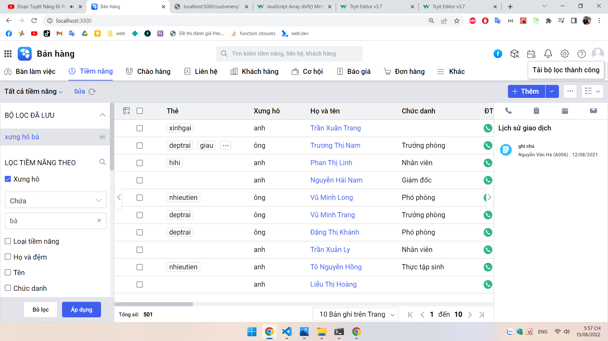
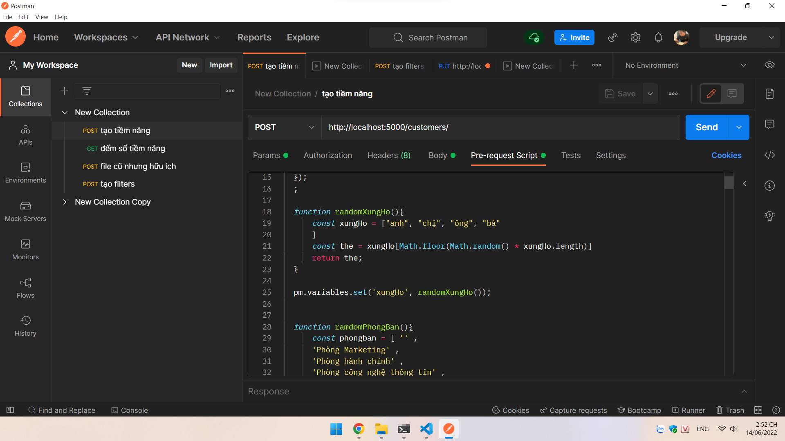
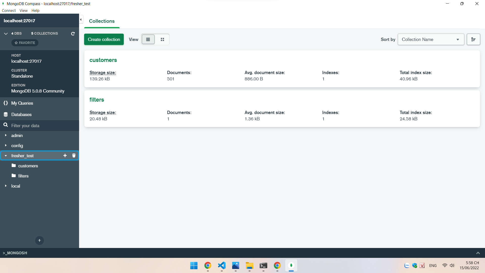

# Bài làm đề fresher test
## Bài tập fresher web - khối quản trị kinh doanh

Phân hệ tiềm năng giúp nhân viên kinh doanh quản lý được các khách hàng đang là tiềm
năng có thể ra quyết định mua hàng. Dữ liệu có thể lấy từ nhiều nguồn khác nhau nhằm
phục vụ việc tiếp cận các khách hàng, phân tích, chăm sóc, marketing để từ đó chuyển đổi
khách hàng tiềm năng thành các khách hàng thật.

## Xây dựng phân hệ tiềm năng - AMIS bán hàng

Xây dựng giao diện, API, database hoàn thiện cho các chức năng trên cho riêng phân hệ
này theo các thiết kế (hình ảnh giao diện) có sẵn và được cung cấp trong mục UI đính kèm.
Màn hình danh sách có thể làm được:
- Hiển thị danh sách các tiềm năng.
- Thêm mới tiền năng.
- Tích chọn một hoặc nhiều bản ghi để xoá, xuất khẩu, sửa nhanh dữ liệu cho từng trường.
- Mở rộng, thu gọn được sidebar trái, phải.
- Hover từng dòng biết được đang đứng ở bản ghi nào, chọn vào tên tiềm năng có thể mở ra
chi tiết của tiềm năng đó.

## Test localhost
### Giao diện web

### Tạo nhiều document bằng Postman

### Đường link api được lấy từ backend trả về dạng JSON, sau này thêm vào frontend

### Cơ sở dữ liệu khách hàng trong MongoDB Compass

## Công cụ và công nghệ sử dụng

Đã sử dụng Visual Studio Code để lập trình
Sử dụng công nghệ và thư viện dưới đây:

- UI component Framework: JavaScript library: ReactJs
- API service: NodeJS : ExpressJS
- Database: MongoDB Cloud Atlas

